# CodeConnect

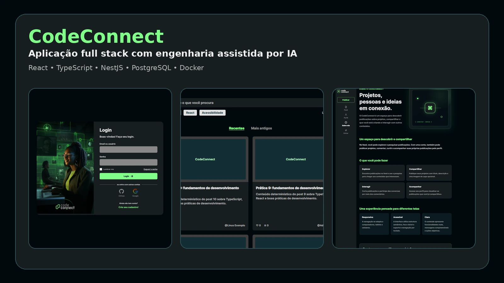

CodeConnect é uma plataforma para publicar, descobrir e interagir com conteúdos sobre tecnologia. O projeto é um monorepo com frontend React/Vite, API NestJS e PostgreSQL.

## Demonstração visual

### Feed público e pesquisa

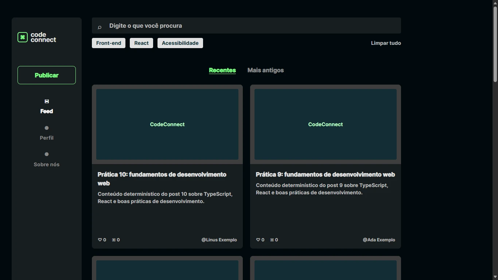

O feed é público, possui paginação e pesquisa full-text processada no PostgreSQL.

### Publicação autenticada

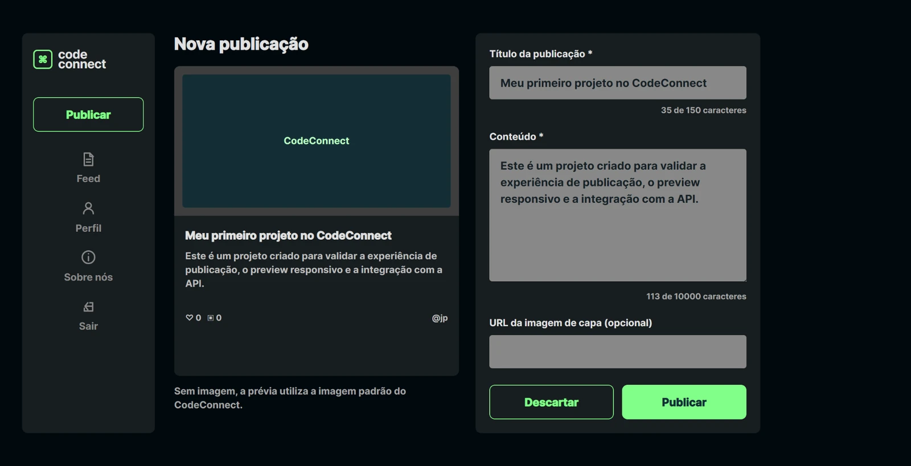

Pessoas autenticadas podem publicar projetos com título, conteúdo e thumbnail opcional por URL HTTP(S). A interface apresenta uma prévia antes do envio.

### Detalhes e interações

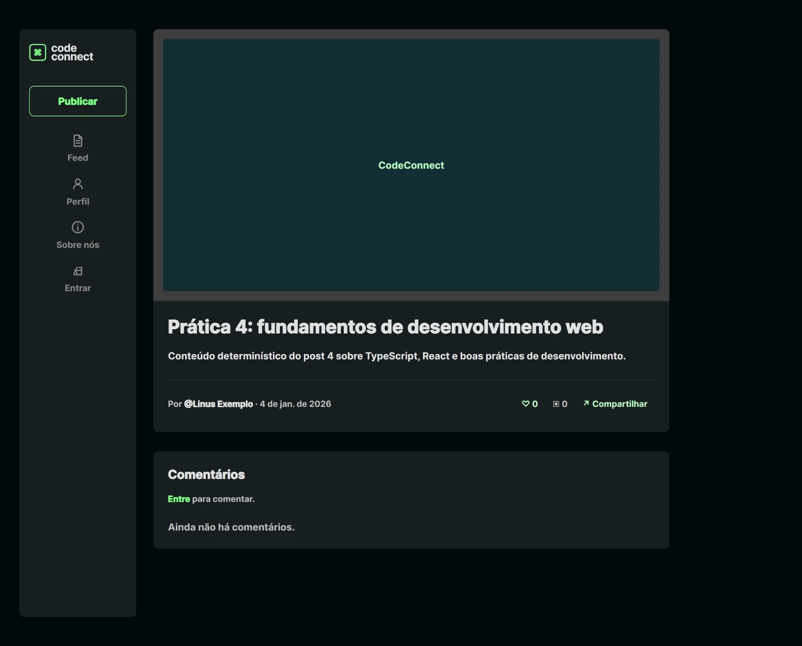

As páginas de detalhes são públicas. Curtidas e comentários exigem autenticação, enquanto o compartilhamento permanece disponível.

### Perfil autenticado

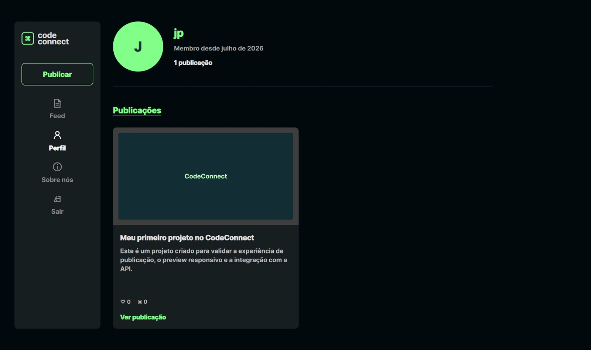

O perfil apresenta os dados públicos necessários da sessão e lista as publicações do usuário autenticado.

### Página institucional e responsividade

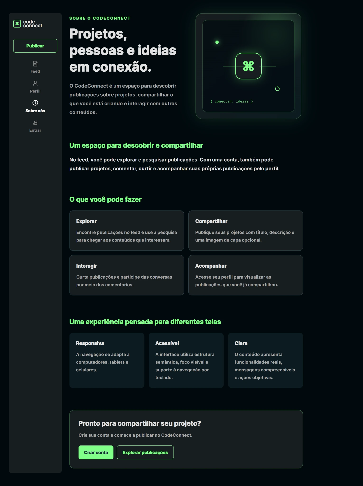

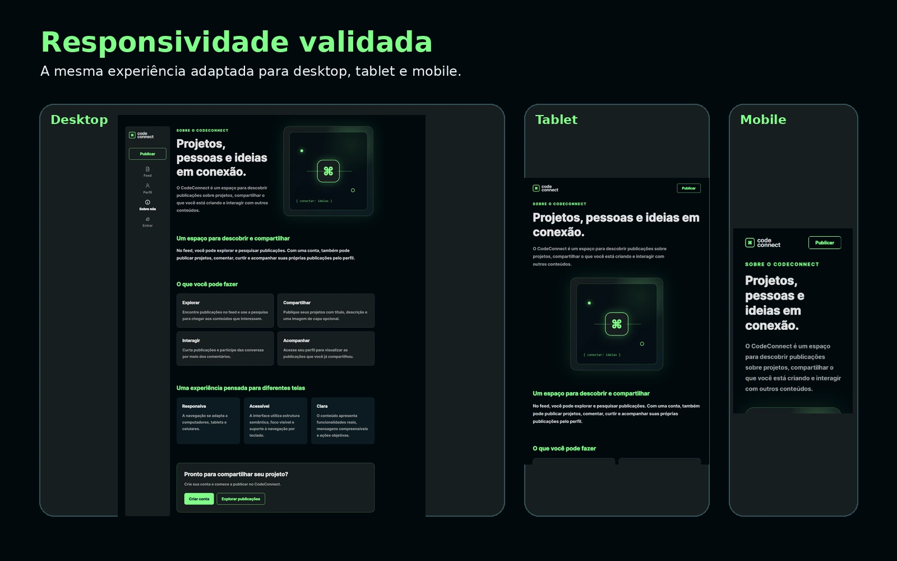

A navegação e o conteúdo foram validados em desktop, tablet e mobile.

## Arquitetura

- `apps/web`: React, TypeScript e Vite. O proxy `/api` encaminha requisições ao backend local.
- `apps/api`: NestJS, TypeORM, PostgreSQL, JWT, bcrypt e Swagger.
- `docs/design/references`: referências visuais de desenvolvimento, fora do bundle da aplicação.
- `docs/portfolio`: evidências visuais e técnicas preparadas para apresentação do projeto.

## Funcionalidades

- Cadastro, login, restauração de sessão e logout.
- Feed público, pesquisa full-text no PostgreSQL e paginação.
- Detalhes públicos, compartilhamento, comentários e curtidas.
- Publicação autenticada e perfil autenticado com as próprias publicações.
- Página pública Sobre nós.
- Thumbnail opcional com fallback.
- Swagger/OpenAPI, responsividade e recursos de acessibilidade.

## Evidências técnicas

### API documentada com Swagger/OpenAPI

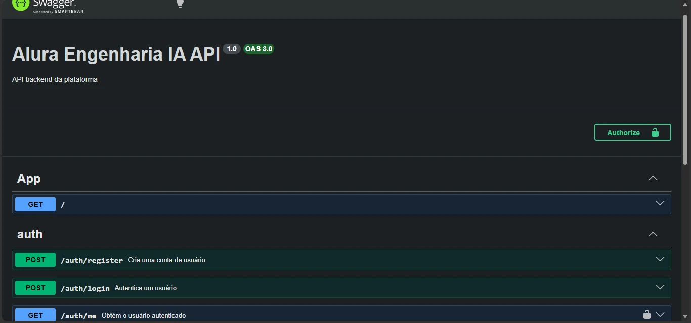

### PostgreSQL separado para desenvolvimento e testes

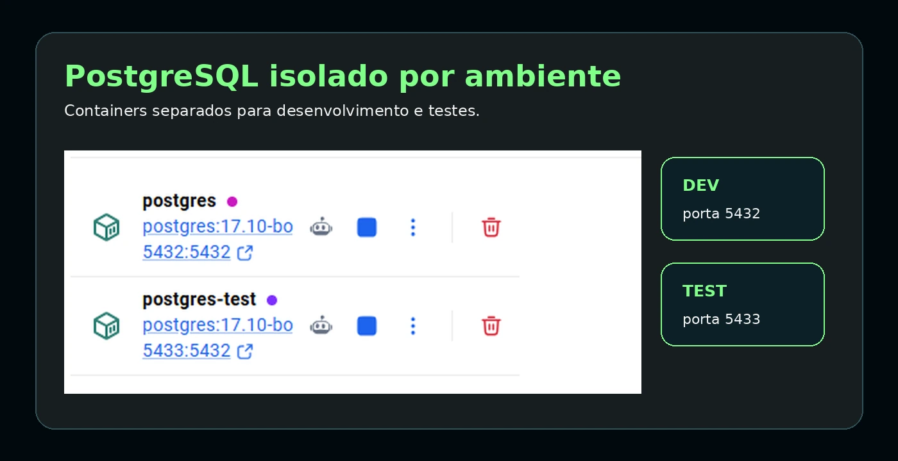

O Docker Compose mantém o banco de desenvolvimento na porta `5432` e o banco isolado de testes na porta `5433`.

### Qualidade automatizada

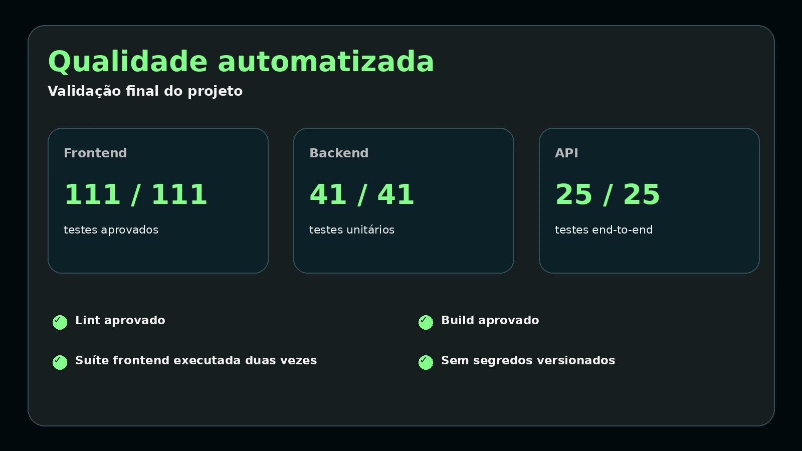

Validação final registrada:

- frontend: 111 testes aprovados em duas execuções completas;
- backend: 41 testes unitários aprovados;
- API: 25 testes end-to-end aprovados;
- lint e builds aprovados;
- nenhuma credencial ou segredo versionado.

## Pré-requisitos e instalação

Use Node.js, pnpm, Docker Desktop e Git. Instale as dependências e mantenha a configuração local da API em um arquivo `.env` não versionado, criado a partir do exemplo. Não versione credenciais.

```powershell
pnpm.cmd install
```

## Banco e migrations

Inicie o banco de desenvolvimento e aplique as migrations explícitas:

```powershell
docker compose --env-file apps/api/.env up -d postgres
pnpm.cmd --filter api migration:show
pnpm.cmd --filter api migration:run
```

O banco isolado de testes usa o serviço `postgres-test` e o profile `test`:

```powershell
docker compose --env-file apps/api/.env --profile test up -d postgres-test
```

`synchronize` e `migrationsRun` permanecem desativados; as migrations cobrem usuários, posts, comentários e curtidas.

## Executar

```powershell
pnpm.cmd api:dev
pnpm.cmd web:dev
```

Frontend: `http://127.0.0.1:5173` · API: `http://127.0.0.1:3000` · Swagger: `http://127.0.0.1:3000/docs`.

## Qualidade

```powershell
pnpm.cmd web:lint
pnpm.cmd web:test
pnpm.cmd web:build
pnpm.cmd api:lint
pnpm.cmd api:test
pnpm.cmd api:test:e2e
pnpm.cmd api:build
```

## Rotas

Rotas públicas do frontend: `/feed`, `/login`, `/cadastro`, `/posts/:id` e `/sobre`.

Rotas protegidas do frontend: `/publicar` e `/perfil`.

Na API, `GET /posts`, detalhes e comentários são públicos. Registro e login são públicos; `/auth/me`, criação de posts e comentários, curtidas e `GET /profile/me/posts` exigem Bearer JWT.

## Segurança atual

O token JWT fica provisoriamente em `sessionStorage` por uma chave centralizada. Senhas não são armazenadas no frontend, e o backend decide autorização e autoria. Uma evolução recomendada é usar cookie Secure, HttpOnly e SameSite com refresh token.

## Limitações atuais

- Sem upload binário; a thumbnail usa URL HTTP(S).
- Sem tags persistidas.
- Sem edição ou exclusão de posts.
- Sem edição ou exclusão de comentários.
- Sem respostas aninhadas.
- JWT provisoriamente em `sessionStorage`.
- Sem perfil público ou edição de perfil.

## Processo de desenvolvimento com IA

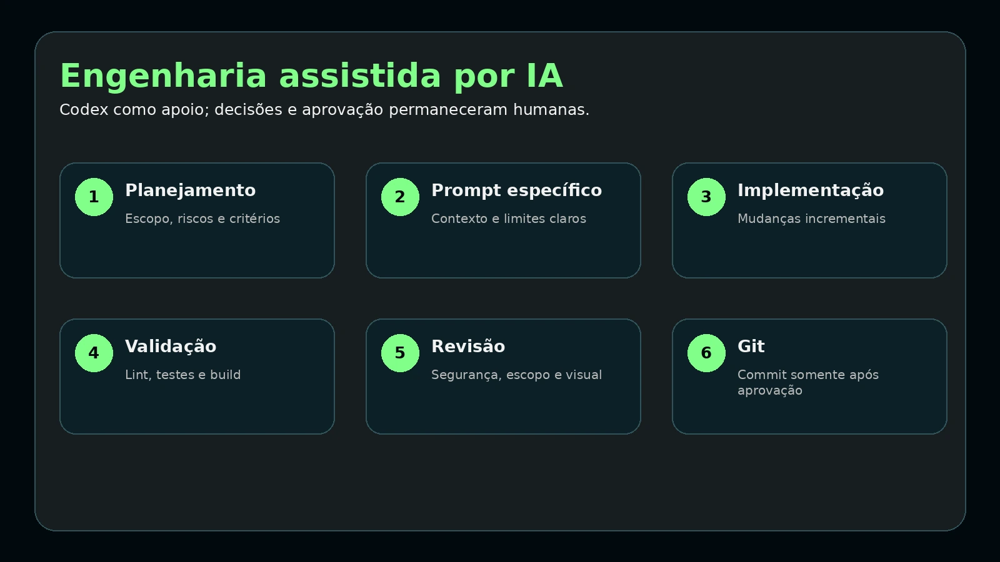

O projeto foi desenvolvido de forma incremental, com planejamento antes de cada etapa e uso do OpenAI Codex como apoio à implementação. As regras de arquitetura, segurança, testes, escopo e Git foram mantidas em `AGENTS.md`, que cumpre a função de contexto do agente.

Os prompts foram específicos e as alterações foram divididas em fases. Todo código sugerido foi revisado antes de ser aceito. Cada etapa passou por lint, testes, build, auditoria de segurança e escopo e revisão visual quando aplicável. Os commits foram realizados somente após as validações correspondentes; a IA não substituiu a supervisão técnica, que permaneceu obrigatória.

## Mais evidências

A seleção completa, as legendas e os critérios usados estão em [`docs/portfolio/README.md`](docs/portfolio/README.md).
